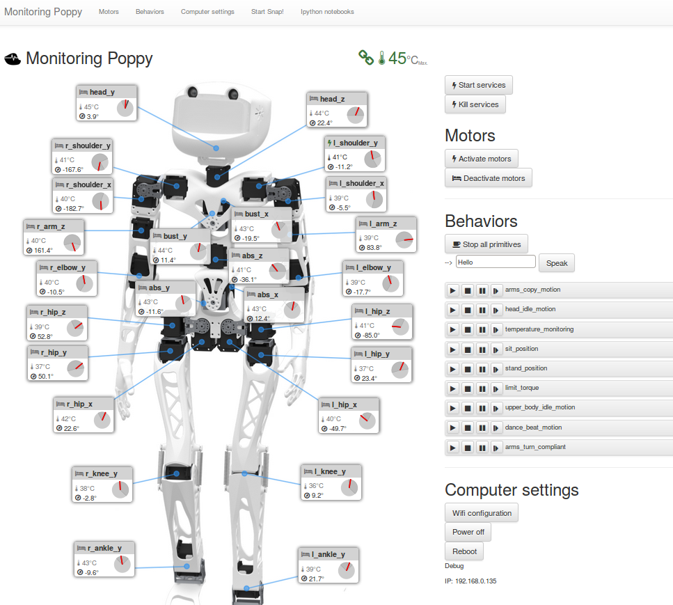

# poppy-monitor

Web tool to monitor and pilot poppy project robot.

It uses Rest API to communicate with the Robot instance. Should now be compatible with the last version of pypot

Allows to watch un realtime temperature, position of the motors, provide a visual and audible alarm when motors are to hot, etc. ...

It also allows you to control the robot:
* Start, stop, execute methods and edit properties of Privitives attached to the Robot instance
* Set the motors compliant/not compliant
* Move motors with the mouse

The menu bar allows to open Snap!, the Ipython notebooks, to configure wifi and to power off or restart the robot (for snap! and wifi config, the corresponding folders should be installed, see the install file).
If you have picospeaker, you can make you robot talk.

## How to use it
set your robot's type in the POPPY_CREATURE enviroment variable

export POPPY_CREATURE=poppy-humanoid

or

export POPPY_CREATURE=poppy-torso

use the install file (WARNING! UNTESTED !)
curl -L https://raw.githubusercontent.com/HumaRobotics/poppy-monitor/master/install.sh | bash

What is does: 
- set a few envronment variables
- check apache installation and install it if needed
- change apache user 
- download the files in /var/www/poppy_webapps

open http://poppy.local in your web browser.

## Licence
GNU GPL v3
